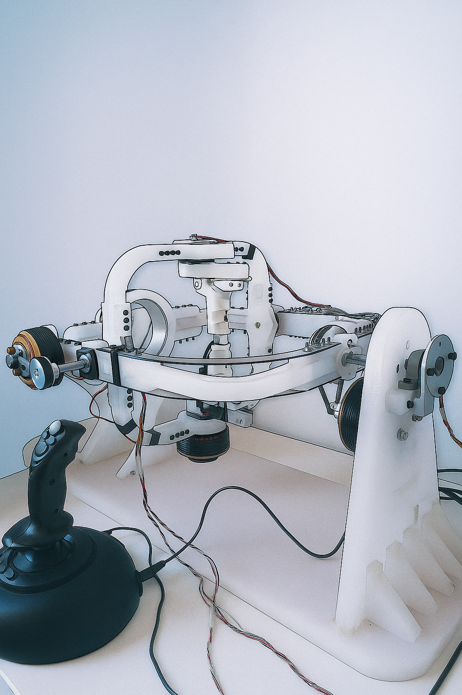

# Panik

**Panik** is an STM32-based project that runs **micro-ROS** to command and communicate with the **Wrist TeleRehab Robot**.

---



---

## Installation

First, ensure you have:

- A Linux machine  
- Properly installed **ROS 2** (for me: ROS2 *Jazzy* on Ubuntu 24.04)  
- micro-ROS configured on your STM32 board  

For setting up micro-ROS on STM32, I followed:  
- [micro-ROS official GitHub](https://github.com/micro-ROS/)  
- [stm32_micro_ros_setup by lFatality](https://github.com/lFatality/stm32_micro_ros_setup)  
- [This YouTube tutorial](https://www.youtube.com/watch?v=xbWaHARjSmk&t=1022s)  

---

### Required Packages

If you haven’t already installed the **joy** package for joystick control:

```bash
sudo apt install ros-$ROS_DISTRO-joy
```
For force-feedback support from the Wrist Robot, install *evtest* and *joystick* tools:
```bash
sudo apt install joystick evtest
```
For more on force-feedback tools, see the [fftest man page](https://man.archlinux.org/man/fftest.1.en).


## Detecting the Joystick

If you connect a *Microsoft SideWinder Force Feedback 2 joystick*:
```bash
cat /proc/bus/input/devices | grep -A6 -i sidewinder
```
Expected output (example):
```vbnet
N: Name="Microsoft SideWinder Force Feedback 2 Joystick"
P: Phys=usb-0000:00:14.0-2.1/input0
S: Sysfs=/devices/pci0000:00/0000:00:14.0/usb3/3-2/3-2.1/3-2.1:1.0/0003:045E:001B.0003/input/input9
U: Uniq=
H: Handlers=event7 js0 
B: PROP=0
B: EV=20001b
```
Note: The event number (event7) and joystick ID (js0) will be needed later.

## Test Joystick Force Feedback

Using *fftest* tool:
```bash
fftest /dev/input/event7
```
Note: replace *event7* with your own event number.

## Clone the Repository

```bash
git clone https://github.com/AliiRezaei/Panik
```

## Uploading Code to STM32

### Using STM32CubeIDE

1. Open stm32_ws as a **Makefile** project with the correct toolchain.
2. Compile and upload directly from the IDE.

### Using OpenOCD

1. Open stm32_ws in a terminal:
```bash
make clean
make
```
If errors occur, double-check your micro-ROS STM32 setup.

2. Upload with OpenOCD:
```bash
openocd -f interface/stlink.cfg -f target/stm32f4x.cfg
```
3. In another terminal, run GDB:
```bash
arm-none-eabi-gdb
```
Connect and flash:
```bash
target remote localhost:3333
monitor reset init
monitor reset halt
monitor flash write_image erase build/stm32_ws.elf
monitor resume
```

## Communication Setup
After connecting the main board to your PC via serial cable, check out connected port
```bash
sudo dmesg | grep tty
```
It is ttyUSB0 for me.
    
1. Run the micro-ROS agent:
```bash
ros2 run micro_ros_agent micro_ros_agent serial -b 921600 --dev /dev/ttyUSB0
```
Note: replace ttyUSB0 with your own port name.

2. Verify topics:
```bash
ros2 topic list
```
You should see */joint_states* and */joint_desireds*.

### Manual Command Test
Open a terminal and set the desireds looks like:
```bash
ros2 topic pub --once /joint_desireds sensor_msgs/msg/JointState "{name: ['joint1', 'joint2', 'joint3'], position: [0.0, 0.0, 0.0], velocity: [0.0, 0.0, 0.0], effort: [0.0, 0.0, 0.0]}"
```
### Joystick Control
1. Start the joy node:
```bash
ros2 run joy joy_node --ros-args -p dev:=/dev/input/js0
```
(Replace js0 with your joystick ID.)
    
2. Translate joystick input to robot commands:
```bash
ros2 run sidewinder_joystick joy_to_desired
```

## Conclusion
Panik enables seamless communication between the Wrist TeleRehab Robot and ROS 2 through STM32 + micro-ROS.
Feel free to contribute, suggest improvements, or open issues for troubleshooting.
